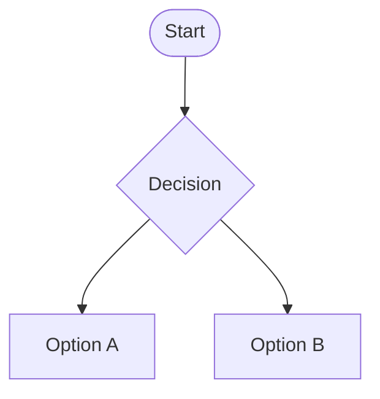

# Caso de Uso: [ID]

## Nome

Jogar Partida do Jogo da Velha

## Descrição

Usuário joga uma partida do jogo da velha contra outro jogador ou contra a máquina.

## Atores

- Ator primário: Jogador

- Ator secundário: Computador  (opcional)

## Pré-condições

1. O usuário acessou a página do jogo da velha.
2.O jogo está carregado e pronto para iniciar.
3.O tabuleiro está vazio no início da partida.

## Fluxo Básico

1. O usuário acessa a página do jogo da velha.
2.O sistema exibe o tabuleiro vazio (3x3).
3.O usuário escolhe jogar contra outro jogador ou contra a IA.
4.O jogador 1 faz a primeira jogada clicando em uma célula vazia do tabuleiro.
5.O sistema marca a jogada no tabuleiro (com X ou O).
6.O próximo jogador faz sua jogada.
7.O sistema verifica se há um vencedor ou empate após cada jogada.
8.Caso haja vencedor, o sistema exibe a mensagem de vitória para o jogador correspondente.
9.Caso não haja vencedor, a vez passa para o próximo jogador.
10.O jogo continua até que haja um vencedor ou empate.
11.O sistema permite reiniciar a partida para jogar novamente.

## Fluxos Alternativos

### [Alternativa 1]

1. [Passo 1]
2. [Passo 2]
3. [Passo n]

### [Alternativa 2]

1. [Passo 1]
2. [Passo 2]
3. [Passo n]

## Fluxos de Exceção

### [Exceção 1]

1. [Passo 1]
2. [Passo 2]
3. [Passo n]

### [Exceção 2]

1. [Passo 1]
2. [Passo 2]
3. [Passo n]

## Pós-condições

1. [Pós-condição 1]
2. [Pós-condição 2]
3. [Pós-condição n]

## Requisitos Relacionados

- [Requisito 1]
- [Requisito 2]
- [Requisito n]

## Interface de Usuário

[Descrição ou referência a protótipos/mockups]

## Diagrama

