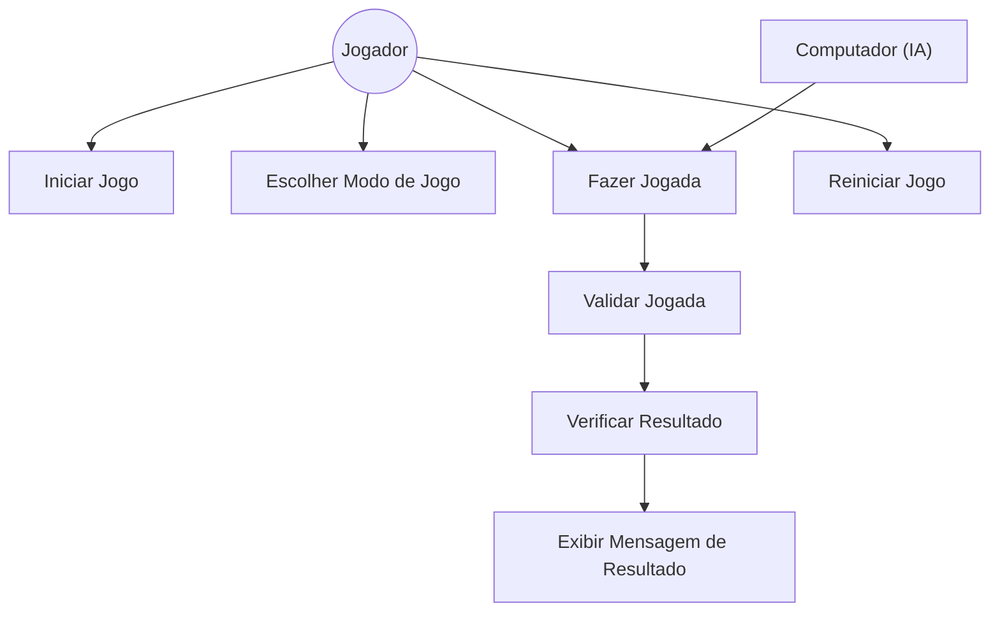

# Caso de Uso: [ID]

## Nome

Jogar Partida do Jogo da Velha

## Descrição

Usuário joga uma partida do jogo da velha contra outro jogador ou contra a máquina.

## Atores

- Ator primário: Jogador

- Ator secundário: Computador  (opcional)

## Pré-condições

1. O usuário acessou a página do jogo da velha.
2.O jogo está carregado e pronto para iniciar.
3.O tabuleiro está vazio no início da partida.

## Fluxo Básico

1. O usuário acessa a página do jogo da velha.
2.O sistema exibe o tabuleiro vazio (3x3).
3.O usuário escolhe jogar contra outro jogador ou contra a IA.
4.O jogador 1 faz a primeira jogada clicando em uma célula vazia do tabuleiro.
5.O sistema marca a jogada no tabuleiro (com X ou O).
6.O próximo jogador faz sua jogada.
7.O sistema verifica se há um vencedor ou empate após cada jogada.
8.Caso haja vencedor, o sistema exibe a mensagem de vitória para o jogador correspondente.
9.Caso não haja vencedor, a vez passa para o próximo jogador.
10.O jogo continua até que haja um vencedor ou empate.
11.O sistema permite reiniciar a partida para jogar novamente.

## Fluxos Alternativos

### [Alternativa 1]

Alternativa 1: Jogar contra a máquina

1.O usuário seleciona a opção de jogar contra o computador.
2.O usuário faz a primeira jogada.
3.O sistema executa a jogada da máquina automaticamente.
4.O fluxo continua como no fluxo básico a partir do passo 7.

### [Alternativa 2]

1.Jogador tenta marcar célula já ocupada
2.O jogador clica em uma célula já marcada.
3.O sistema não aceita a jogada e exibe uma mensagem informando que a célula está ocupada.
4.O jogador faz uma nova tentativa.

## Fluxos de Exceção

### [Exceção 1]

- O jogo não carrega corretamente a página ou os recursos (HTML/CSS/JS).
- O sistema exibe uma mensagem de erro para o usuário.
- O usuário tenta recarregar a página.

### [Exceção 2]

- O jogador tenta realizar uma jogada inválida (ex: clicar fora do tabuleiro).
- O sistema exibe uma mensagem de erro informando que a ação é inválida.
- O jogador deve realizar uma jogada válida para continuar.

## Pós-condições

1. O jogo termina com um vencedor ou empate.
2.O tabuleiro exibe o estado final da partida.
3.O usuário pode iniciar uma nova partida a qualquer momento.

## Requisitos Relacionados

- O sistema deve permitir iniciar uma nova partida.
- O sistema deve validar jogadas para garantir que não sejam feitas em células ocupadas.
- O sistema deve detectar vitória, derrota ou empate corretamente.
- O sistema deve permitir escolher entre jogar contra outro jogador ou contra a máquina.
- O sistema deve apresentar uma interface gráfica responsiva e intuitiva.

## Interface de Usuário

Tela principal com o tabuleiro 3x3 exibido em formato de grid.
Botões para iniciar nova partida e escolher modo de jogo (multiplayer ou contra IA).
Indicador de jogador da vez (X ou O).
Mensagens dinâmicas para avisos (ex: vitória, empate, célula ocupada).
Visual video-game retro, limpo e responsivo com destaque para o tabuleiro.

## Diagrama

